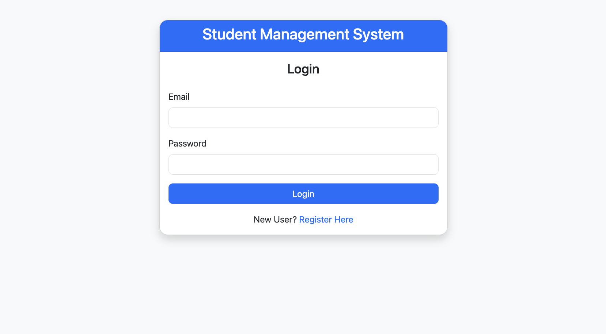
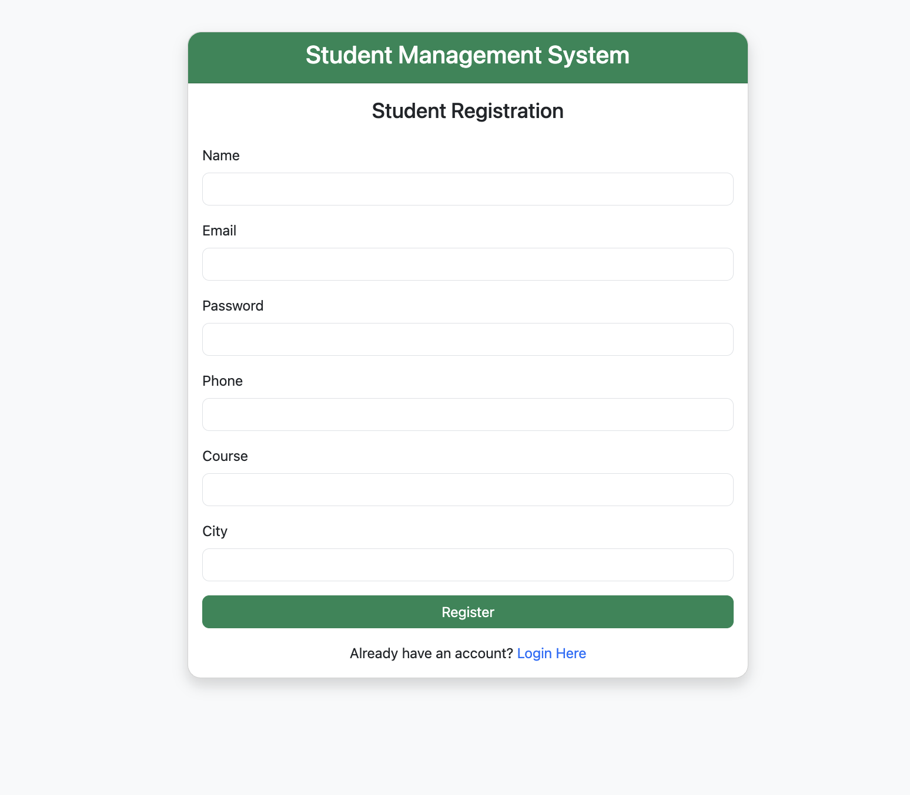
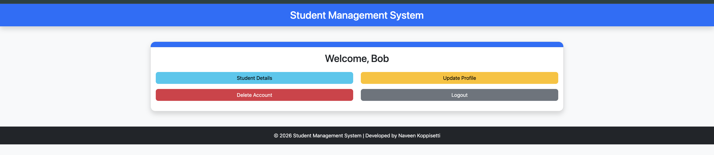
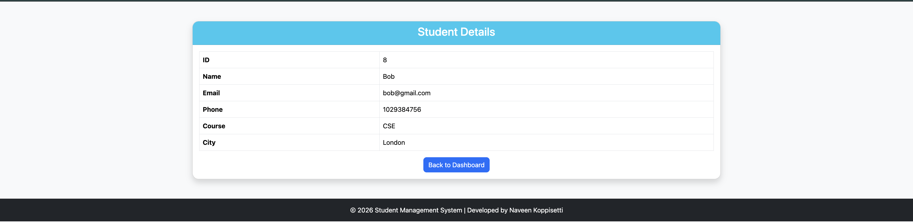
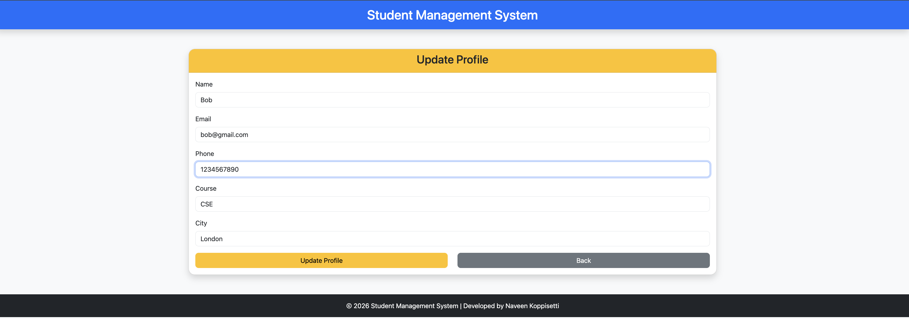
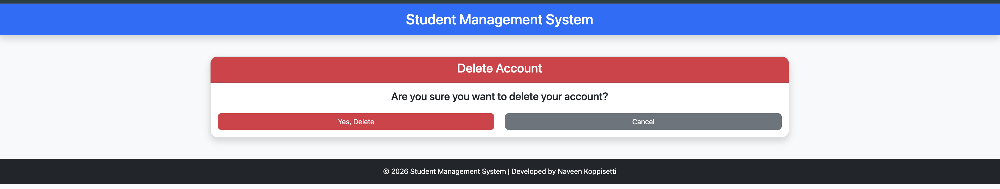
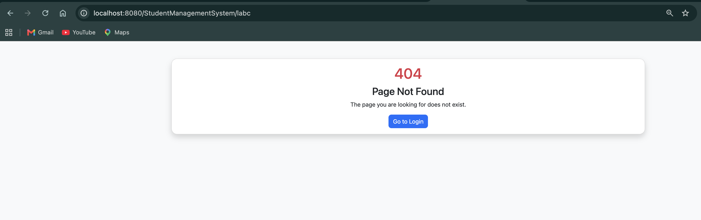
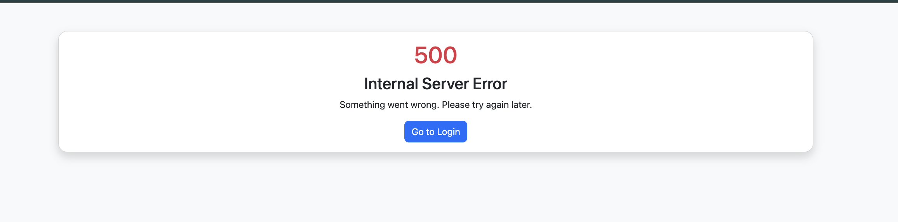

# 🎓 Student Management System

A secure and responsive **Student Management System** built using **Java Servlets, JSP, JDBC, MySQL, Bootstrap 5, and Apache Tomcat 11**.

The application allows students to register, log in securely, manage their profile, and perform CRUD operations while following the **MVC (Model-View-Controller)** architecture. It also demonstrates industry-standard concepts such as password hashing, session management, servlet filters, and authentication.

---

## 🚀 Features

### 👤 User Management
- Student Registration
- Secure Login & Logout
- View Student Details
- Update Student Profile
- Delete Student Account

### 🔐 Security
- SHA-256 Password Hashing
- Session Management
- Cookie Management
- Authentication Filter
- Cache Control (Prevents accessing protected pages after logout)
- Duplicate Email Validation
- HTML5 Form Validation

### 🎨 User Interface
- Responsive Bootstrap 5 Design
- Professional Dashboard
- Flash Success & Error Messages
- Custom 404 Error Page
- Custom 500 Error Page

---

# 🛠️ Tech Stack

| Category | Technology |
|----------|------------|
| Language | Java 21 |
| Backend | Jakarta Servlet 6.0 |
| Frontend | JSP, HTML5, CSS3, Bootstrap 5 |
| Database | MySQL |
| Connectivity | JDBC |
| Server | Apache Tomcat 11 |
| Architecture | MVC |

---

# 📂 Project Structure

```
StudentManagementSystem
│
├── src
│   ├── controller
│   ├── dao
│   ├── database
│   ├── filter
│   ├── model
│   └── util
│
├── WebContent / webapp
│   ├── css
│   ├── login.jsp
│   ├── register.jsp
│   ├── home.jsp
│   ├── details.jsp
│   ├── update.jsp
│   ├── delete.jsp
│   ├── header.jsp
│   ├── footer.jsp
│   ├── 404.jsp
│   └── 500.jsp
│
├── ScreenShorts
├── README.md
└── .gitignore
```

---

# 🏗️ MVC Architecture

```
Browser
   │
   ▼
JSP (View)
   │
   ▼
Servlet (Controller)
   │
   ▼
DAO (Model)
   │
   ▼
MySQL Database
```

---

# 🔄 Application Workflow

## Registration

```
Student
    │
    ▼
Register Form
    │
    ▼
Input Validation
    │
    ▼
Duplicate Email Check
    │
    ▼
SHA-256 Password Hashing
    │
    ▼
MySQL Database
```

## Login

```
Student
    │
    ▼
Login Form
    │
    ▼
SHA-256 Password Hashing
    │
    ▼
Credential Verification
    │
    ▼
Session Creation
    │
    ▼
Dashboard
```

---

# 💾 Database

### Database Name

```
studentmanagementsystem
```

### Table Name

```
students
```

### Columns

| Column | Description |
|---------|-------------|
| id | Student ID |
| name | Student Name |
| email | Email Address |
| password | SHA-256 Encrypted Password |
| phone | Mobile Number |
| course | Course Name |
| city | City |

---

# 📸 Screenshots

## Login Page



---

## Registration Page



---

## Dashboard



---

## Student Details



---

## Update Profile



---

## Delete Confirmation



---

## Custom 404 Error Page



---

## Custom 500 Error Page



---

# 📖 Key Concepts Implemented

- MVC Architecture
- CRUD Operations
- JDBC with MySQL
- Java Servlets
- JSP
- Session Management
- Cookie Management
- Authentication & Authorization
- Servlet Filters
- SHA-256 Password Encryption
- HTML5 Validation
- Exception Handling
- Custom Error Pages
- Responsive Bootstrap UI

---

# 🔮 Future Enhancements

- Forgot Password
- Email Verification
- Admin Panel
- Role-Based Access Control
- Profile Image Upload
- REST API Integration
- Spring Boot Migration
- JWT Authentication

---

# 👨‍💻 Author

**Naveen Koppisetti**

- 🎓 2026 Computer Science Engineering Graduate
- 💻 Java Full Stack Developer
- 🌱 Passionate about Backend Development and Problem Solving

---

# ⭐ Support

If you found this project useful, please consider giving it a **⭐ Star** on GitHub.
